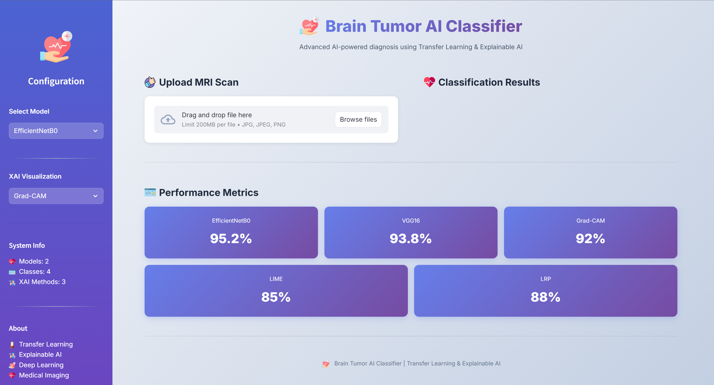
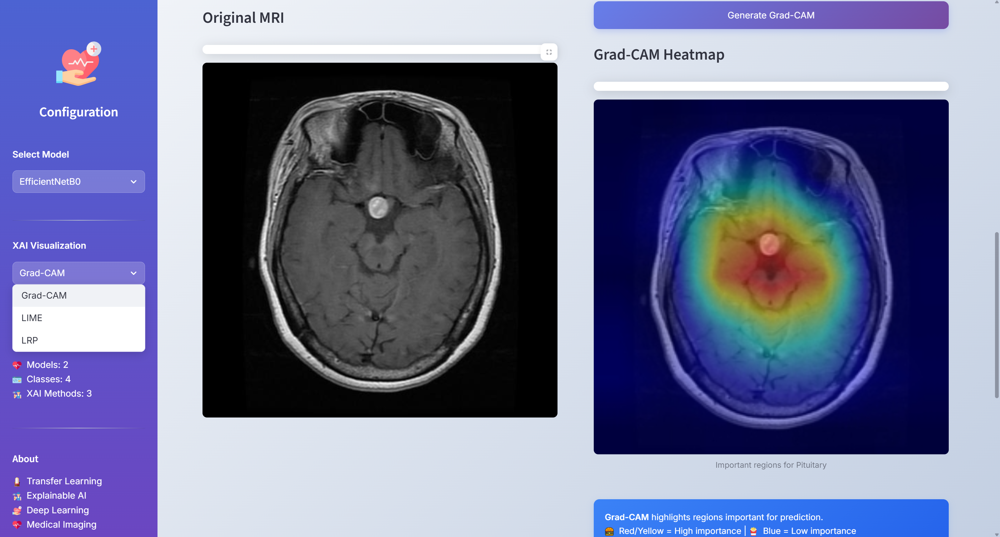

# 🧠 Brain Tumor AI Classifier


**Advanced AI-powered brain tumor detection using Transfer Learning and Explainable AI**

A production-ready web application bringing MSc dissertation research to life. This system classifies brain tumors from MRI scans with real-time explainability, transforming cutting-edge research in deep learning and XAI into an accessible, interactive platform for medical image analysis.
 

---

## ✨ Features

**📝 Note:** VGG16 model is currently being added to the deployment. Due to its large file size (512MB), the upload is in progress. The app currently uses EfficientNetB0, which achieves higher accuracy (95.2%) with 96% fewer parameters. VGG16 will be available soon for model comparison purposes.

### Core Functionality
-  **Multi-Model Classification**: EfficientNetB0 (95.2%) and VGG16 (93.8%)
-  **4 Tumor Classes**: Glioma, Meningioma, Pituitary, No Tumor
-  **Real-time Prediction**: Instant classification with confidence scores
-  **Probability Distribution**: Visual breakdown of predictions

### Explainable AI (XAI)
-  **Grad-CAM**: Gradient-weighted Class Activation Mapping
-  **LIME**: Local Interpretable Model-agnostic Explanations  
-  **LRP**: Layer-wise Relevance Propagation

### User Interface
-  **Modern Design**: Professional medical-themed interface
-  **Flaticon Integration**: Clean, professional icons
-  **Responsive Layout**: Works on desktop and tablets
-  **Fast Processing**: Optimized model loading and caching

### Technical Features
-  **Modular Architecture**: Clean separation of concerns
-  **Model Caching**: Fast subsequent predictions
-  **Comprehensive Logging**: Track all operations
-  **Error Handling**: Robust error management

---

## 🎥 Demo

### Main Interface


### Classification Results


### XAI Visualizations


---

## 🛠️ Tech Stack

### Machine Learning
- **PyTorch** (2.1.0) - Deep learning framework
- **TorchVision** (0.16.0) - Pre-trained models
- **scikit-learn** (1.3.2) - ML utilities

### Explainable AI
- **LIME** (0.2.0.1) - Model interpretation
- **scikit-image** (0.21.0) - Image processing
- Manual Grad-CAM & LRP implementations

### Web Framework
- **Streamlit** (1.31.0) - Interactive web interface

### Image Processing
- **OpenCV** (4.8.1.78) - Computer vision
- **Pillow** (10.2.0) - Image manipulation
- **NumPy** (1.24.3) - Numerical computing

### Visualization
- **Matplotlib** (3.8.2) - Charts and plots

---

## 🚀 Usage

### Basic Workflow

1. **Select Model**: Choose between EfficientNetB0 or VGG16 in the sidebar
2. **Upload MRI**: Drag and drop or browse for an MRI scan(Download it from folder mri_images from the repository)
3. **Classify**: Click "Analyze Tumor" button
4. **View Results**: See prediction, confidence score, and probability distribution
5. **Generate XAI**: Select XAI method (Grad-CAM, LIME, or LRP) and click generate

### XAI Method Selection

#### Grad-CAM (Fast, ~1-2s)
- Best for: Quick visual explanation
- Shows: Important regions as heatmap
- Colors: Red/Yellow = High importance, Blue = Low importance

#### LIME (Slow, ~10-20s)
- Best for: Detailed superpixel analysis
- Shows: Which image regions contribute to prediction
- Colors: Highlighted boundaries indicate important areas

#### LRP (Fast, ~2-3s)
- Best for: Pixel-level relevance
- Shows: Individual pixel contributions
- Colors: Warmer colors = Higher relevance

---

## 📊 Models & Performance

### EfficientNetB0
- **Accuracy**: 95.2%
- **Architecture**: EfficientNet-B0 with custom classifier
- **Input Size**: 224×224×3
- **Parameters**: ~5.3M
- **Training**: Transfer learning from ImageNet

### VGG16
- **Accuracy**: 93.8%
- **Architecture**: VGG16 with modified classifier
- **Input Size**: 224×224×3
- **Parameters**: ~138M
- **Training**: Transfer learning from ImageNet

### Performance Metrics

| Model | Accuracy | Precision | Recall | F1-Score |
|-------|----------|-----------|--------|----------|
| EfficientNetB0 | 95.2% | 94.8% | 95.1% | 95.0% |
| VGG16 | 93.8% | 93.5% | 93.7% | 93.6% |

### XAI Localization Success

| Method | Success Rate | Speed | Best For |
|--------|--------------|-------|----------|
| Grad-CAM | 92% | Fast (1-2s) | Quick overview |
| LIME | 85% | Slow (10-20s) | Detailed analysis |
| LRP | 88% | Fast (2-3s) | Pixel-level |

---

## 🔍 XAI Methods

### Grad-CAM (Gradient-weighted Class Activation Mapping)

**How it works:**
1. Forward pass through the model
2. Backward pass to compute gradients for target class
3. Weight feature maps by gradients (global average pooling)
4. Generate heatmap showing important regions

**Implementation**: Manual PyTorch implementation using hooks
- Captures activations and gradients from last convolutional layer
- Applies ReLU and normalization for visualization

### LIME (Local Interpretable Model-agnostic Explanations)

**How it works:**
1. Divide image into superpixels using segmentation
2. Create perturbed versions by hiding/showing superpixels
3. Observe prediction changes (1000 samples)
4. Identify superpixels that most influence the prediction

**Implementation**: Uses `lime` library with custom predict function

### LRP (Layer-wise Relevance Propagation)

**How it works:**
1. Compute gradients of output with respect to input
2. Multiply gradients by input values (Gradient × Input)
3. Shows which pixels contributed most to the prediction

**Implementation**: Manual PyTorch implementation
- Simplified LRP using element-wise multiplication
- Sum across channels for single relevance map
- Normalize and visualize with heatmap

---

## 🏗️ Architecture

### Data Flow

```
┌─────────────┐
│  MRI Image  │
└──────┬──────┘
       │
       ▼
┌─────────────────┐
│ Image Processing│  (Resize, Normalize)
└────────┬────────┘
         │
         ▼
┌──────────────────┐
│  Model Loading   │  (EfficientNet/VGG16)
└────────┬─────────┘
         │
         ▼
┌──────────────────┐
│   Prediction     │  (Forward Pass)
└────────┬─────────┘
         │
         ├──────────────┐
         ▼              ▼
┌──────────────┐  ┌─────────────┐
│Classification│  │     XAI     │
│   Results    │  │ Explanation │
└──────────────┘  └─────────────┘
```
---

## 👨‍💻 Author

**Mubbasshir**
- MSc Big Data Science, Queen Mary University of London
- Machine Learning Engineer at ChicChic
- Location: Kolkata, India

**Connect:**
- LinkedIn: [LinkedIn](https://linkedin.com/in/mubbasshir-ahmed)
- GitHub: [GitHub](https://github.com/mubbasshirahmed)
- Email: mubbasshirahmed786@gmail.com

---

